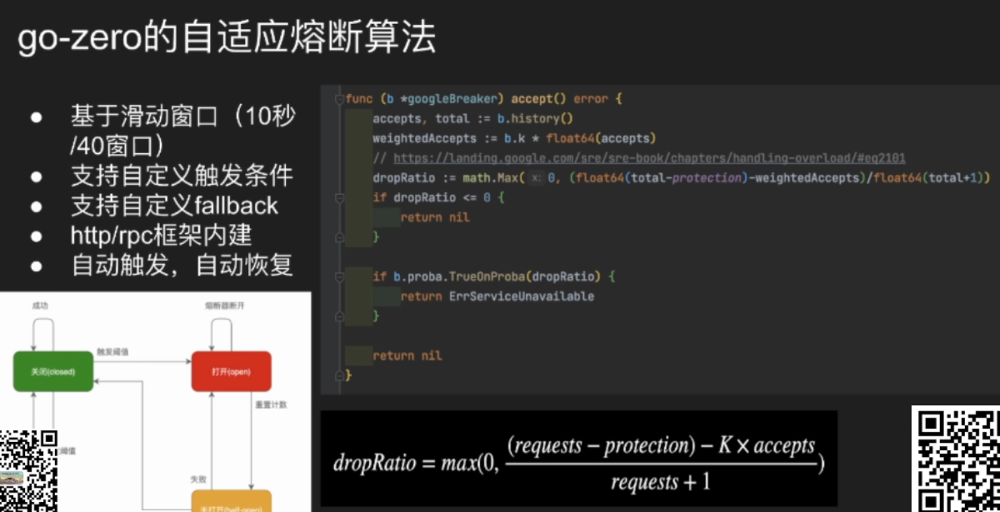

集中了web和rpc的微服务框架

自定义了API的一种语法，通过goctl来自动生成

# 1.go zero微服务能力

三点，service B要去注册中心注册，并且定时续期，这样服务A才能去发现他并且调用，最后，还有注销

实现插件时，service A启动的时候要能够获取B的所有节点

B有新的节点上来A要能拿到并且同步

A没法获取B的状态，就变成只读状态，等恢复以后，再变成可写状态？

均衡把流量打到节点上去：

缓存的自动管理，缓存跟sqlx没有任何关系：

唯一索引->主键->数据  保证数据只有一份

# 2.go zero 并发组件

默认生成多个虚拟节点，分布在hash环上，数据分散在每个节点上

应用场景  做负载均衡 

做缓存，依赖一致性hash，同一个数据，一定要写在一个redis，否则在多个redis，不仅有空间浪费，还会不知道在哪

进程内的mapreduce：

调多个微服务，串行 一个一个顺序调，并行调，一堆数据怎么合起来，一个服务出问题，其他的怎么cancel掉，

防死锁：超过多长时间就自动释放

可重入：本进程lock一次，再去lock 一个进程调多次没关系 只要释放就行

不管有几个打过来，只会创建一个

# 3.go zero生态

# 

go-zero不做更新缓存 只做删除缓存

先更新DB，再删除缓存，不做更新

https://go-zero.dev/cn/redis-cache.html

https://go-zero.dev/cn/buiness-cache.html

gozero怎么处理缓存？

对查多条的业务，很难做好缓存

任何拿部分数据的查询，都会拿到完整的数据放到缓存里面，并且有且只有一份

Take里面做了业务

基于索引的缓存管理：

model的代码都是一键生成的

